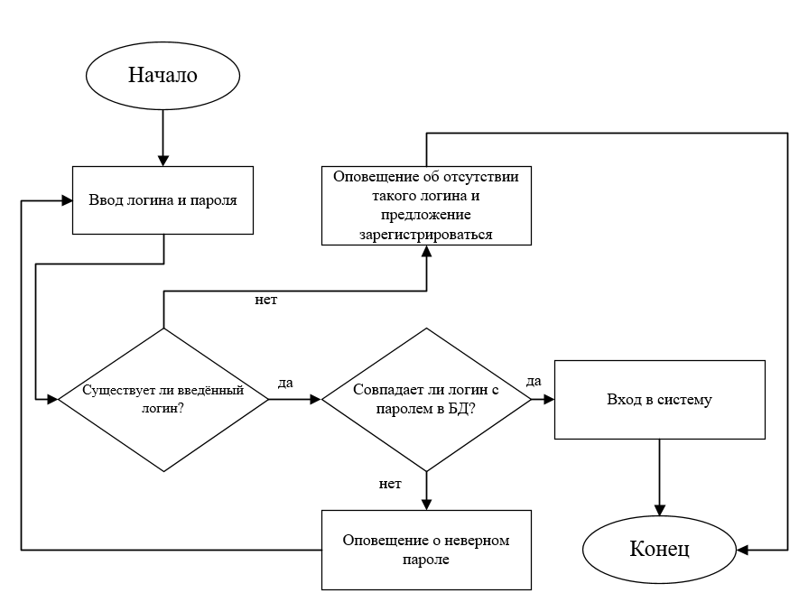
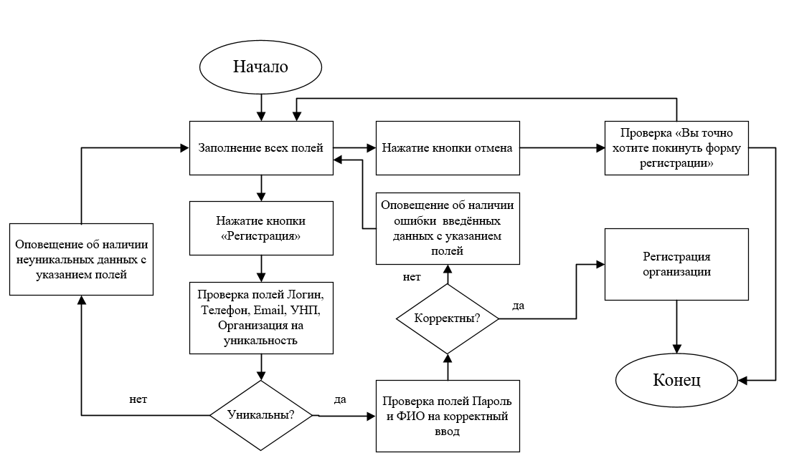
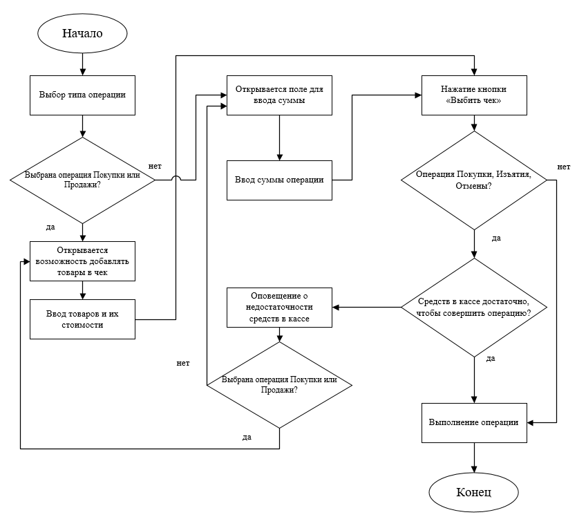
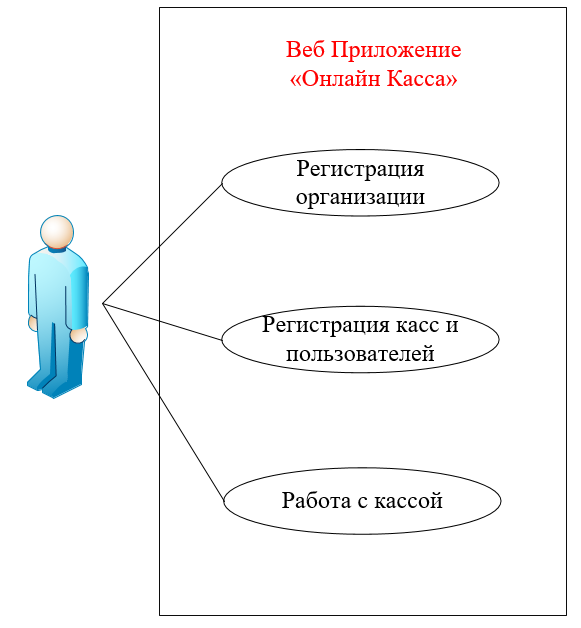
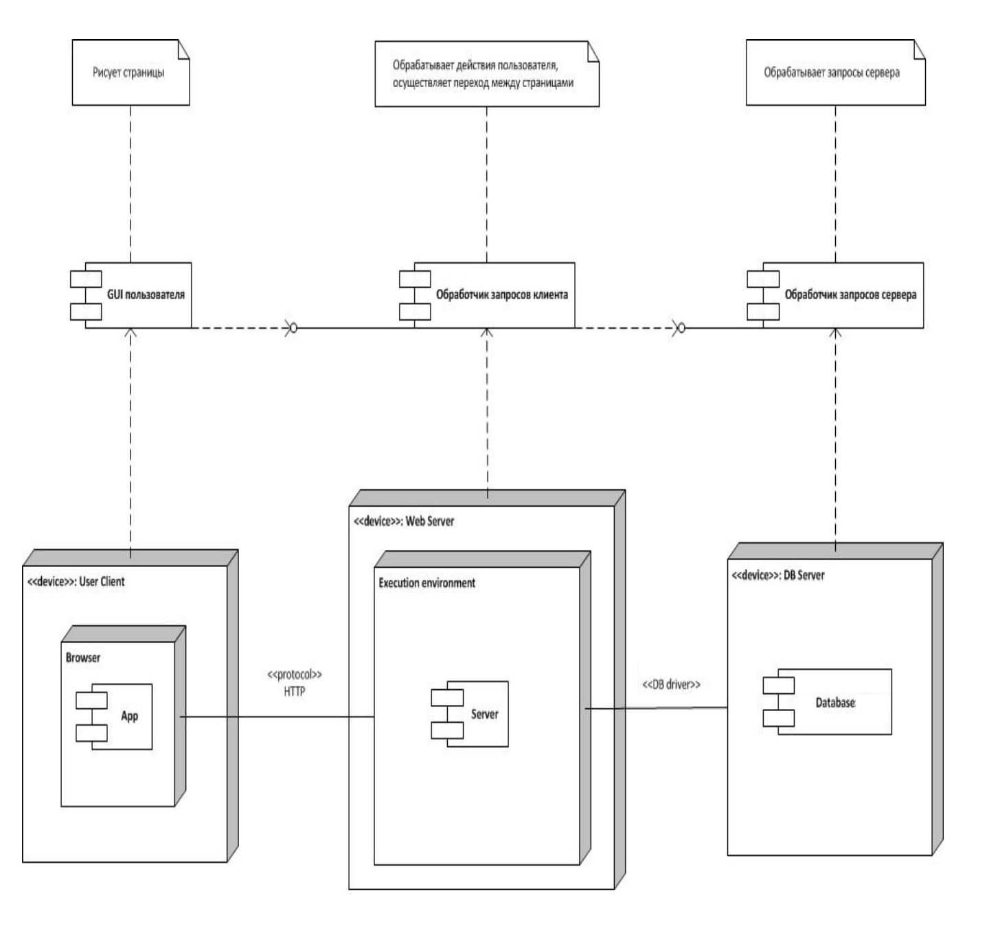

# Содержание
1 [Моделирование динамического поведения системы](#1)  
1.1. [Диаграммы последовательности](#1.1)  
1.2. [Диаграммы активности](#1.2)   
1.3. [Диаграммы состояний](#1.3)  
2. [Моделирование статической структуры системы](#2)  
2.1. [Диаграмма компонентов](#2.1)  
2.2. [Диаграмма развёртывания](#2.2)  

<a name="1"/>

#  1. Моделирование динамического поведения системы

<a name="1.1"/>

1.1. [Диаграммы последовательности](#1.1)  

<a name="1.2"/>

1.2. [Диаграммы активности](#1.2)   
**Вход в систему**

**Регистрация организации**

**Проведение операции по кассе**

<a name="1.3"/>

1.3. [Диаграмма состояний](#1.3) 

<a name="2"/>

#  2. Моделирование статической структуры системы

<a name="2.1"/>

##  2.1. Диаграмма компонентов

<a name="2.2"/>

##  2.2. Диаграмма развёртывания

